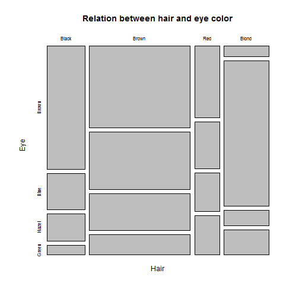

Developing Data Products
========================================================
author: Soumya Ranjan Patra
date: 25 June 2017
autosize: true

Overview
========================================================

This application was built as part of the Developing Data Products course in Coursera.

The shiny app developed can be found here <https://spatra.shinyapps.io/DataProducts/>.

The code for the app and this presentation are hosted here <https://github.com/srpatra88/dataproducts>.
 
Shiny Application
========================================================
Given the principal amount, simple annual interest rate and the number of years, the shiny app us calculate the simple interest value.

Simple interest is calculated only on the principal amount, or on that portion of the principal amount that remains. It excludes the effect of compounding. Simple interest can be applied over a time period other than a year, e.g. every month. Simple interest is calculated according to the following formula:

P * r * n/100

where P is the principal amount, r is the simple annual interest rate, n is the frequency of applying interest.

Executable R expression
========================================================
Since there were no datasets used as input for this application, we use a sample dataset from R (HairEyeColor) and generate a plot. The plot shows the relation between hair and eye color. Results are shown as a mosaic plot.

Executable R expression
========================================================

```r
require(graphics)
x <- apply(HairEyeColor, c(1, 2), sum)
mosaicplot(x, main = "Relation between hair and eye color")
```


